# GPU2 SATR Architecture

This diagram is the exact architecture used by the GPU2 full-joint SATR checkpoint:

`_probe/full_joint_satr/GOLA-codetrack_full-2026.10.05-13.24.00-843554/checkpoint/epoch_05/model.bin`

```mermaid
flowchart LR
    classDef input fill:#E8F5E9,stroke:#2E7D32,color:#1B5E20,stroke-width:1.5px
    classDef backbone fill:#E3F2FD,stroke:#1565C0,color:#0D47A1,stroke-width:1.5px
    classDef check fill:#FFF3E0,stroke:#EF6C00,color:#E65100,stroke-width:1.5px
    classDef temporal fill:#E0F7FA,stroke:#00838F,color:#006064,stroke-width:1.5px
    classDef repair fill:#F3E5F5,stroke:#6A1B9A,color:#4A148C,stroke-width:1.5px
    classDef output fill:#FCE4EC,stroke:#AD1457,color:#880E4F,stroke-width:1.5px
    classDef note fill:#FAFAFA,stroke:#757575,color:#424242,stroke-dasharray:4 3

    RGB[RGB search image]:::input
    TIR[TIR search image]:::input
    TMP[Initial and online templates]:::input
    GOLA[GOLA DINOv2 B\nViT B 14, 12 blocks\n768 dimensional tokens]:::backbone
    RGB --> GOLA
    TIR --> GOLA
    TMP --> GOLA
    FL[Fused feature sequence FL\nZRGB, XRGB, ZTIR, XTIR, Zon, DTIR]:::backbone
    GOLA --> FL
    XRGB[X_RGB\nraw RGB search tokens]:::input
    XTIR[X_TIR\nraw TIR search tokens]:::input
    CTX[Template context\ninitial plus online]:::input
    FL --> XRGB
    FL --> XTIR
    FL --> CTX
    H[Sparse parity check matrix H\n64 checks x 256 variables\n12 links per check, locality 5]:::check
    PROJ[Cross modal projections\nU from RGB, R from TIR plus template]:::check
    RES[Cross modal residual\nU minus R]:::check
    SYN[Syndrome s\nH aggregated check evidence]:::check
    BP[Neural belief propagation\n3 iterations, damping 0.5\nerror probability q]:::check
    MOT[Kalman motion prior\npredicted box and uncertainty]:::temporal
    MEM[Reliable history memory\n3 frames, 8 tokens per frame]:::temporal
    GATE[Reliability gate\nq, motion uncertainty, memory reliability]:::check
    SATR[SATR Tanner recovery\n3 rounds, H neighbours, other modality, history, motion\nup to 32 highest q tokens]:::repair
    WRITE[Selective write back\nXout equals XTIR plus q times gate times DeltaX\nabstention off in GPU2]:::repair
    HEAD0[Original GOLA head\nscore map and box]:::backbone
    TRACK[Original GOLA tracking head\nclassification, box regression, output]:::output
    LOSS[Joint supervision\ntracking, diagnosis, recovery, preservation, memory, motion\n5 epoch checkpoint]:::note
    H --> RES
    PROJ --> RES
    RES --> SYN
    H --> SYN
    SYN --> BP
    H --> BP
    XRGB --> PROJ
    XTIR --> PROJ
    CTX --> PROJ
    BP --> GATE
    MOT --> GATE
    MEM --> GATE
    MOT --> MEM
    XRGB --> SATR
    XTIR --> SATR
    H --> SATR
    MOT --> SATR
    MEM --> SATR
    GATE --> SATR
    XTIR --> WRITE
    SATR --> WRITE
    GATE --> WRITE
    WRITE --> HEAD0
    HEAD0 --> TRACK
    HEAD0 -. confidence .-> MOT
    HEAD0 -. reliable admission .-> MEM
    LOSS -. train .-> BP
    LOSS -. train .-> SATR
    LOSS -. train .-> TRACK
    linkStyle default stroke:#455A64,stroke-width:1.4px
```

